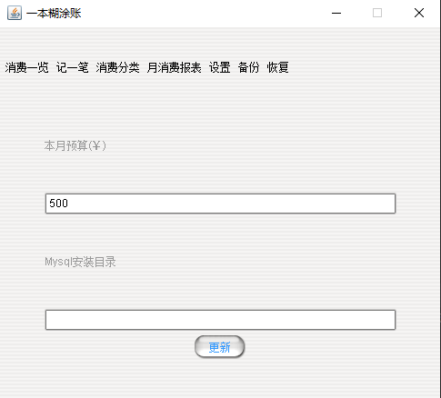
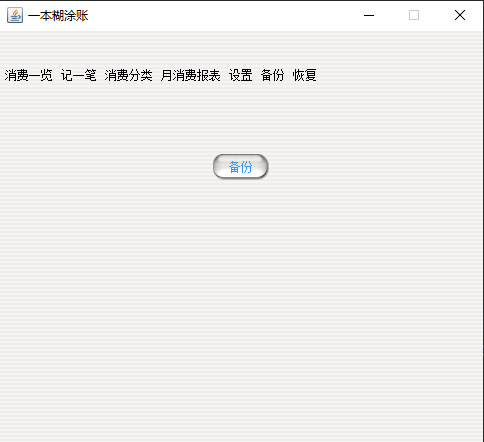

# Hutubill

一个记账系统，用于联系javase基础，从how2j上学习的，如有违规，请联系我删除。

<!-- PROJECT SHIELDS -->

[![Contributors][contributors-shield]][contributors-url]
[![Forks][forks-shield]][forks-url]
[![Stargazers][stars-shield]][stars-url]
[![Issues][issues-shield]][issues-url]
[![MIT License][license-shield]][license-url]
[![LinkedIn][linkedin-shield]][linkedin-url]

<h3 align="center">Hutubill</h3>
  <p align="center">
    一个用于记账的小系统
  </p>

本篇README.md主要是记录项目

## 目录

- [上手指南](#上手指南)
    - [开发前的配置要求](#开发前的配置要求)
    - [安装步骤](#安装步骤)
- [文件目录说明](#文件目录说明)
  - [开始界面](#开始界面)
  - [记录界面](#记录界面)
  - [分类界面](#分类界面)
  - [报表界面](#报表界面)
  - [设置界面](#设置界面)
  - [备份界面](#备份界面)
  - [恢复界面](#恢复界面)
- [运行界面展示](#运行界面展示)
- [版本控制](#版本控制)
- [作者](#作者)

### 上手指南
###### 开发前的配置要求

1. java JDK8 或者 JDK11 两者都可以，项目原作者用的8，我用11开发也可以运行
2. eclipse 建议访问how2j网站去下载作者提供的版本，idea的话2023.1就可以

###### **安装步骤**

1. 将仓库克隆下来

```sh
git clone https://github.com/Holiday-C/java_hutubill.git
```

2. 导入idea运行src目录下的startup里面的Bootstrap

### 文件目录说明
eg:

```
hututbill
├── .idea
│  ├── .gitignore
│  └── ...
├── bin
│  └── ...
├── img
│  └── ...
├── lib
│  └── ...
├── sql
│  └── hutubill.sql
├── src
│  ├── dao
│  │  ├── CategoryDAO
│  │  ├── ConfigDAO
│  │  └── RecordDAO
│  ├── entity
│  │  ├── Category
│  │  ├── Config
│  │  └── Record
│  ├── gui
│  │  ├── frame
│  │  │  └── MainFrame
│  │  ├── listener
│  │  │  └──...
│  │  ├── model
│  │  │  └──...
│  │  ├── page
│  │  │  └──...
│  │  └── panel
│  │     └──...
│  ├── service
│  │  └── ...
│  ├── startup
│  │  └── Bootstrap
│  ├── test
│  │  └── ...
│  ├── util
│  │  └── ...
│  └── HutuMainFrame
├── .classpath
├── .project
├── hutubill.iml
└── README.md
```

### 运行界面展示
###### 开始界面

<p align="center">
  <a href="https://github.com/Holiday-C/java_hutubill/">
    
  </a>
</p>

###### 记录界面

<p align="center">
  <a href="https://github.com/Holiday-C/java_hutubill/">
    
  </a>
</p>

###### 分类界面

<p align="center">
  <a href="https://github.com/Holiday-C/java_hutubill/">
    
  </a>
</p>

###### 报表界面

<p align="center">
  <a href="https://github.com/Holiday-C/java_hutubill/">
    
  </a>
</p>

###### 设置界面

<p align="center">
  <a href="https://github.com/Holiday-C/java_hutubill/">
    
  </a>
</p>

###### 备份界面

<p align="center">
  <a href="https://github.com/Holiday-C/java_hutubill/">
    
  </a>
</p>

###### 恢复界面

<p align="center">
  <a href="https://github.com/Holiday-C/java_hutubill/">
    
  </a>
</p>


### 版本控制

该项目使用Git进行版本管理。您可以在repository参看当前可用版本。

### 作者

holiday


<!-- links -->
[your-project-path]:Holiday-C/java_hutubill
[contributors-shield]: https://img.shields.io/github/contributors/Holiday-C/java_hutubill.svg?style=flat-square
[contributors-url]: https://github.com/Holiday-C/java_hutubill/graphs/contributors
[forks-shield]: https://img.shields.io/github/forks/Holiday-C/java_hutubill.svg?style=flat-square
[forks-url]: https://github.com/Holiday-C/java_hutubill/network/members
[stars-shield]: https://img.shields.io/github/stars/Holiday-C/java_hutubill.svg?style=flat-square
[stars-url]: https://github.com/Holiday-C/java_hutubill/stargazers
[issues-shield]: https://img.shields.io/github/issues/Holiday-C/java_hutubill.svg?style=flat-square
[issues-url]: https://img.shields.io/github/issues/Holiday-C/java_hutubill.svg
[license-shield]: https://img.shields.io/github/license/Holiday-C/java_hutubill.svg?style=flat-square
[license-url]: https://github.com/Holiday-C/java_hutubill/blob/master/LICENSE.txt
[linkedin-shield]: https://img.shields.io/badge/-LinkedIn-black.svg?style=flat-square&logo=linkedin&colorB=555
[linkedin-url]: https://linkedin.com/in/Holiday-C